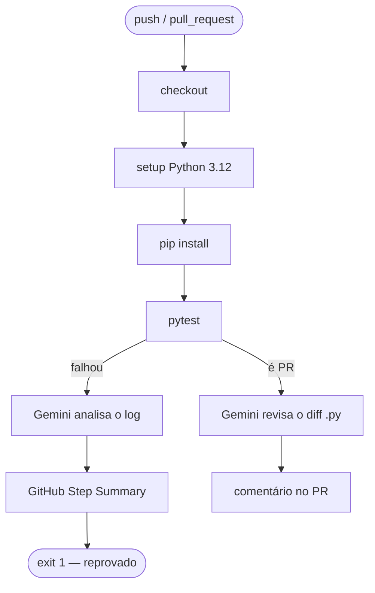

# lab-ci-ia

Laboratório de integração entre **CI/CD** e **Inteligência Artificial**, desenvolvido como projeto prático da PUC. Demonstra como incorporar diagnóstico automatizado com LLM (Gemini) diretamente no pipeline do GitHub Actions para acelerar a identificação e correção de falhas.

---

## Visão Geral

O projeto implementa uma calculadora em Python como domínio de negócio, mas o foco real é a infraestrutura de CI/CD aumentada com IA. O pipeline realiza duas ações inteligentes automaticamente:

1. **Diagnóstico de falha**: quando os testes quebram, o log é enviado ao Gemini que retorna uma análise estruturada em 3 bullet points com causa e correção sugerida.
2. **Code review automatizado**: a cada Pull Request, o diff dos arquivos `.py` é revisado pelo Gemini que aponta melhorias de qualidade, boas práticas e possíveis bugs.

---

## Estrutura do Projeto

```
lab-ci-ia/
├── calculadora.py              # Módulo principal com as operações matemáticas
├── conftest.py                 # Configuração global do pytest
├── requirements.txt            # Dependências Python
├── tests/
│   └── test_calculadora.py     # Suite de testes unitários
└── .github/
    └── workflows/
        └── ci.yml              # Pipeline de CI com diagnóstico por IA
```

---

## Módulo `calculadora.py`

### Funções disponíveis

| Função | Assinatura | Descrição |
|---|---|---|
| `somar` | `somar(a, b)` | Retorna a soma de dois números |
| `subtrair` | `subtrair(a, b)` | Retorna a subtração `a - b` |
| `multiplicar` | `multiplicar(a, b)` | Retorna o produto de dois números |
| `dividir` | `dividir(a, b)` | Retorna `a / b`; levanta `ValueError` se `b == 0` |
| `raiz_quadrada` | `raiz_quadrada(n)` | Retorna `√n`; levanta `ValueError` se `n < 0` |
| `porcentagem` | `porcentagem(valor, percentual)` | Retorna `valor * percentual / 100` |

### Exemplos de uso

```python
from calculadora import somar, dividir, raiz_quadrada, porcentagem

somar(10, 5)           # 15
dividir(10, 4)         # 2.5
raiz_quadrada(16)      # 4.0
porcentagem(200, 15)   # 30.0

# Exceções guardadas
dividir(10, 0)         # ValueError: Divisão por zero não é permitida
raiz_quadrada(-9)      # ValueError: Raiz de número negativo não é definida nos reais
```

---

## Testes

Os testes unitários ficam em [tests/test_calculadora.py](tests/test_calculadora.py) e cobrem casos normais, valores-limite e cenários de erro esperados.

### Executar localmente

```bash
# Instalar dependências
pip install -r requirements.txt

# Rodar toda a suite
pytest

# Com output detalhado
pytest -v

# Com cobertura (requer pytest-cov)
pytest --cov=calculadora --cov-report=term-missing
```

### Cobertura atual

| Função | Casos testados |
|---|---|
| `somar` | positivos, negativos, zeros |
| `subtrair` | positivos, resultado negativo |
| `multiplicar` | positivos, negativos, zero |
| `dividir` | inteiro, decimal, divisão por zero |
| `raiz_quadrada` | quadrado perfeito, zero, negativo |
| `porcentagem` | — (sem teste; ver Roadmap) |

---

## Pipeline de CI — `.github/workflows/ci.yml`

O workflow é acionado em **push** e **pull_request** para a branch `main`.



### Etapas em detalhe

| Etapa | Condição | O que faz |
|---|---|---|
| `Executar testes` | sempre | Roda `pytest --tb=short`, captura saída em `test-results.log` com `continue-on-error: true` |
| `Analisar falha com IA` | testes falharam | Envia as últimas 100 linhas do log ao Gemini 2.5 Flash; resultado aparece no **GitHub Step Summary** |
| `Analisar PR com IA` | evento é `pull_request` | Gera diff `origin/main...HEAD` dos `.py`, pede revisão ao Gemini e posta como comentário no PR via `gh pr comment` |
| `Falhar o job após análise` | testes falharam | Executa `exit 1` para que o job seja marcado como falho após a análise da IA |

### Segredos necessários

| Secret | Onde configurar | Uso |
|---|---|---|
| `GEMINI_API_KEY` | Settings → Secrets → Actions | Autenticação na API do Gemini |
| `GITHUB_TOKEN` | Automático pelo GitHub | Postar comentários no PR (`gh pr comment`) |

---

## Configuração do Ambiente Local

**Requisitos:** Python 3.12+

```bash
# 1. Clonar o repositório
git clone https://github.com/wandermaia/lab-ci-ia.git
cd lab-ci-ia

# 2. Criar e ativar ambiente virtual (recomendado)
python -m venv .venv
source .venv/bin/activate   # Linux/macOS
# .venv\Scripts\activate    # Windows

# 3. Instalar dependências
pip install -r requirements.txt

# 4. Rodar os testes
pytest -v
```

---

## Dependências

| Pacote | Versão | Finalidade |
|---|---|---|
| `pytest` | 8.3.5 | Framework de testes unitários |

Biblioteca padrão utilizada: `math` (módulo nativo do Python, sem instalação necessária).

---

## Histórico de Desenvolvimento

O git history deste projeto foi intencionalmente construído para simular cenários reais de CI/CD com bugs:

| Commit | Tipo | Descrição |
|---|---|---|
| `7ffb489` | feat | Calculadora, testes e workflow de CI com IA |
| `15d02a9` | bug | Lógica incorreta em `somar` |
| `3a47c2a` | fix | Corrige lógica de `somar` |
| `8264fc2` | bug | Remove `import math` (quebra `raiz_quadrada`) |
| `98bd795` | fix | Restaura `import math` |
| `7303a77` | bug | Parâmetro obrigatório adicionado sem atualizar testes |
| `d600ed7` | bug | Mesmo cenário, segunda iteração |
| `171a083` | feat | Adiciona função `porcentagem` |
| `1ca5ab7` | merge | Merge do PR `feat/modulo-porcentagem` |

---

## Roadmap

- [ ] Adicionar testes para a função `porcentagem`
- [ ] Configurar `pytest-cov` no workflow e publicar relatório de cobertura
- [ ] Adicionar validação de tipos nas funções (ex: rejeitar strings)
- [ ] Explorar integração com Claude API como alternativa ao Gemini
- [ ] Adicionar badge de status do CI no README

---

## Licença

Projeto acadêmico — PUC. Uso livre para fins educacionais.
